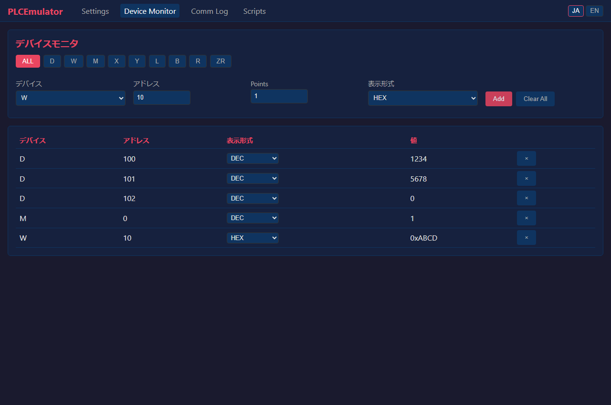

# PLCEmulator

[](https://github.com/euledge/plc-emulator/actions/workflows/ci.yml)
[](LICENSE)
[](pyproject.toml)
[](https://github.com/astral-sh/uv)

PLC communication emulator supporting MC protocol / SLMP

[**日本語版はこちら**](README.ja.md) | [**Release Notes (v0.2.0)**](RELEASE_NOTES_v0.2.0.md) | [**User Manual**](docs/user_manual.md) | [**Script DSL Reference**](docs/script_dsl_reference.md)

> **GitHub topics 候補**: `plc`, `mc-protocol`, `slmp`, `mitsubishi`, `emulator`, `fastapi`, `plc-simulator`, `python`, `scada`, `industrial-automation`

## Features

- **MC Protocol** 3E/1E/4E frames (binary/ASCII) + **SLMP**
- **TCP / UDP** servers
- **Device memory** read/write (bit, word, batch)
- **PLC models** (Q03UDE, Q06UDE, R04CPU, R08CPU, FX5U, L06CPU) with range checking
- **Latency emulation** (none/fixed/random/normal/timeout)
- **Scripting** (YAML DSL + AST-safe evaluation)
  - Periodic write / Ramp / Conditional / Sequence
- **Web UI** (FastAPI + dark theme)
  - Settings panel / Device monitor / Comm log / Script editor
  - WebSocket real-time push / i18n (English, Japanese)
- **State persistence** JSON save/load
- **Unit, integration, and browser tests**

## Web UI Dashboard



The built-in web dashboard provides real-time device monitoring, inline memory editing, communication logging, and autonomous script execution:
- **Device Monitor**: Real-time table viewing across all device types (`ALL` tab) or filtered by type (D, W, M, X, Y, etc.). Supports batch additions via points, 6 display formats (DEC, DEC Signed, HEX, BIN, FLOAT, ASCII), and direct double-click inline editing.
- **Settings Panel**: Dynamic runtime switching of protocols (3E, 1E, 4E, SLMP), transports (TCP/UDP), PLC models, and latency simulation.
- **Communication Log**: Live packet inspector with command badges, hex dump, and text log export.
- **Script Editor**: AST-safe YAML editor with syntax highlighting, line numbers, and preset industrial scenarios.
## Quick Start

```bash
# Install dependencies
uv sync

# Run unit & integration tests
uv run pytest

# Start PLC emulator & Web UI (combined entry point with shared state)
# Default binds Web UI to http://127.0.0.1:8000 and PLC server to port 5000
uv run python main.py

# E2E tests (requires browser install on first run)
uv run playwright install chromium
uv run pytest tests/test_e2e.py
# Note: Add --headed to see the browser window
# uv run pytest tests/test_e2e.py --headed
```

## Project Structure

```
src/
  config.py              # Configuration management
  device/
    device_manager.py    # Device memory manager
    plc_models.py        # PLC model definitions
  protocol/
    constants.py         # Constants (frame and command IDs)
    base.py              # Protocol base class
    device_parser.py     # Device number parser
    mc_frame_3e.py       # MC 3E frame
    mc_frame_1e.py       # MC 1E frame
    mc_frame_4e.py       # MC 4E frame
    slmp_handler.py      # SLMP handler
    command_processor.py # Command processor
  server/
    tcp_server.py        # TCP server
    udp_server.py        # UDP server
    latency.py           # Latency emulator
  scripting/
    builtins.py          # Built-in functions
    evaluator.py         # AST evaluator
    parser.py            # YAML parser
    engine.py            # Script execution engine
  web/
    app.py               # FastAPI application
    api_routes.py        # API routes
    websocket_handler.py # WebSocket manager
  i18n/
    i18n.py              # Translation loader
    ja.json / en.json    # Translation data
  persistence/
    persistence_manager.py # JSON save/load
static/
  index.html             # Web UI
  css/style.css
  js/                    # Frontend JavaScript
scripts/examples/        # Sample scripts
tests/                   # Tests
```

## OpenAPI

Full OpenAPI 3.1 specification: [`docs/openapi.json`](docs/openapi.json)
(14 endpoints, 7 schemas)

## API Reference

| Method | Path | Description |
|--------|------|-------------|
| GET | `/api/config` | Get configuration |
| PUT | `/api/config` | Update configuration |
| GET | `/api/devices/{type}` | Batch read devices |
| PUT | `/api/devices/{type}/{addr}` | Write device |
| GET | `/api/latency/stats` | Latency statistics |
| PUT | `/api/latency/config` | Latency configuration |
| GET | `/api/scripts` | List scripts |
| GET | `/api/scripts/{name}` | Get script content |
| PUT | `/api/scripts/{name}` | Save script |
| POST | `/api/scripts/{name}/start` | Start script |
| POST | `/api/scripts/{name}/stop` | Stop script |
| POST | `/api/save` | Save device state |
| POST | `/api/load` | Load device state |
| GET | `/api/i18n/{lang}` | Translation data |
| WS | `/ws` | WebSocket |

`PUT /api/config` accepts `protocol: "3E"`, `data_format: "binary"`, `transport: "tcp" | "udp"`, `port: 0..65535`, `plc_model`, and `latency_mode` / `latency_params`. Unsupported wire formats return an error without changing the running server. For example, fixed latency uses `{"latency_mode":"fixed","latency_params":{"delay_ms":100}}`.

## Sample Scripts

Practical simulation samples are available in `scripts/examples/` and can also be executed directly from the Web UI's "Scripts" panel.

| Sample File | Type | Description |
|---|---|---|
| `heartbeat.yaml` | `periodic` | Comm health check (toggles M0, increments D0 watchdog counter) |
| `sawtooth.yaml` | `periodic` | Sawtooth wave generator into D100 |
| `sensor_simulation.yaml` | `periodic` | Analog sensor simulation (temperature, pressure, flow rate with noise) |
| `ramp_loop.yaml` | `ramp` | Continuous sweep of D200 from 0→1000 over 10s (looped) |
| `conditional.yaml` | `conditional` | Threshold-based M0 ON/OFF toggle based on D100 |
| `alarm_interlock.yaml` | `conditional` | High-temperature alarm (with hysteresis) & emergency stop interlock |
| `cylinder_sequence.yaml` | `sequence` | Multi-step machine sequence: clamp → process → unclamp/eject → reset |
| `tank_level_control.yaml` | Combined (`periodic` + `conditional`) | Tank level physics simulation with automated pump/drain control |
| `traffic_light.yaml` | `sequence` | Traffic light sequence: Green → Yellow → Red |

### Syntax Examples

```yaml
# 1. Periodic: Analog temperature sensor simulation with noise
- type: periodic
  interval_ms: 500
  actions:
    - target: D100
      expr: "int(clamp(50 + 25 * sin(t * 0.2) + randint(-1, 1), 0, 100))"

# 2. Ramp: Sweep D200 from 0 to 1000 over 10 seconds
- type: ramp
  target: D200
  start_value: 0
  end_value: 1000
  duration_ms: 10000
  loop: true

# 3. Conditional: High-temp alarm (ON at >=75C, OFF at <65C)
- type: conditional
  interval_ms: 200
  conditions:
    - when: "D100 >= 75"
      actions:
        - target: M100
          value: 1
    - when: "D100 < 65"
      actions:
        - target: M100
          value: 0

# 4. Sequence: Clamp → Machine → Eject step workflow
- type: sequence
  loop: true
  steps:
    - wait_ms: 1000
      actions:
        - target: D10  # Step number
          value: 1
        - target: Y10  # Clamp
          value: 1
    - wait_ms: 2000
      actions:
        - target: D10
          value: 2
        - target: Y11  # Machine
          value: 1
    - wait_ms: 1000
      actions:
        - target: D10
          value: 3
        - target: Y10
          value: 0
        - target: Y11
          value: 0
```

## License

MIT
