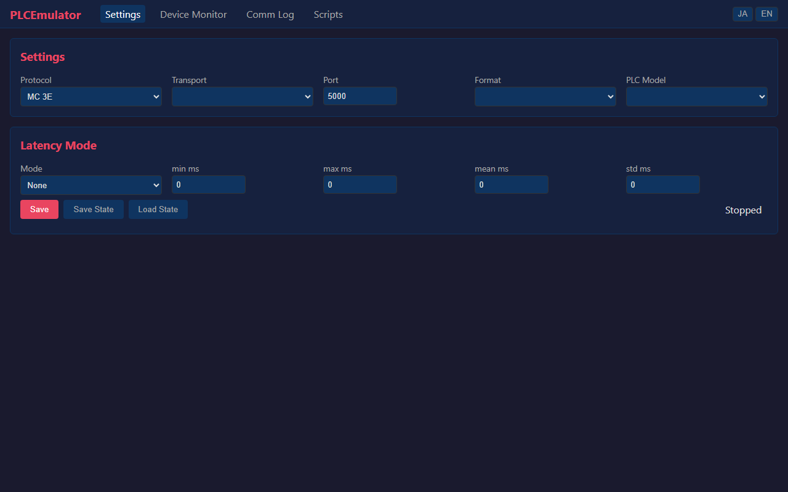

# v0.1.0 — PLC Emulator

**Released:** June 20, 2026

---

## PLC communication emulator for MC Protocol & SLMP

No PLC hardware? No problem. PLCEmulator speaks Mitsubishi MC Protocol (3E, 1E, 4E) and SLMP over TCP or UDP — so you can develop, test, and demo HMI/SCADA integrations without a physical PLC on your desk.



---

### ✨ What's New

#### PLC Server That Talks the Real Protocol

- Run a TCP or UDP server that responds to MC Protocol 3E, 1E, 4E, and SLMP frames
- Supports 10+ commands: batch read/write (0401/1401), loopback test (0619), remote RUN (1001), remote STOP (1002), monitor register (0801), monitor execute (0802), CPU type read (0101)
- Configure protocol, transport, and port — then connect any HMI or test tool

#### Real-Time Web Dashboard

Monitor and control everything from your browser:

| Panel | What You Can Do |
|-------|----------------|
| **Settings** | Switch protocol/transport, change port, configure latency behavior |
| **Device Monitor** | Watch device values update live via WebSocket; add/remove watched addresses |
| **Comm Log** | Inspect every TX/RX packet with timestamps |
| **Script Editor** | Write YAML scripts, save/load them, start/stop execution |

#### YAML Scripting for Automated Simulation

No programming required. Write simple YAML files to simulate device behavior:

- **Periodic** — Write values on a timer. Example: sawtooth wave into `D100` every second.
- **Ramp** — Sweep a value between two endpoints. Example: `D200` ramps from 0→1000 over 10 seconds and loops.
- **Conditional** — React to device values. Example: `M0` turns ON when `D100 > 500`, OFF when `D100 <= 500`.
- **Sequence** — Multi-step workflows with configurable waits between actions.

Expressions support arithmetic, device references (`D100`, `M0`), and built-in functions (`clamp`, `square`, `triangle`, `sawtooth`), plus runtime variables (`t`, `dt`, `tick`).

#### Save & Restore State

Click **Save State** in the Settings panel to export all device values to a JSON file. Click **Load State** to restore them later. Useful for setting up repeatable test scenarios.

#### English / Japanese UI

Toggle between English and Japanese from the top-right language switcher. The entire UI updates instantly.

---

### ⚡ What's Improved

- **Latency Simulation** — Five modes to emulate real network conditions: none, fixed delay, random range, normal distribution, and timeout. Configure via the Settings panel.

---

### 🔒 Security

- **Safe script execution** — The expression evaluator uses Python's AST parser with a strict allowlist. `__import__`, attribute access, and calls to non-whitelisted functions are blocked. Scripts cannot access the filesystem or execute arbitrary code.
- **Thread-safe device access** — Fine-grained locking prevents race conditions in concurrent read/write scenarios.

---

### 📦 Get Started

```bash
git clone https://github.com/euledge/plc-emulator.git
cd plc-emulator
uv sync
uv run uvicorn src.web.app:create_app --factory --reload
```

Open **http://localhost:8000** in your browser.

---

### 🔗 Links

- [Full Changelog](CHANGELOG.md)
- [日本語版リリースノート](RELEASE_NOTES_v0.1.0.ja.md)
- [OpenAPI Spec](docs/openapi.json)
- [English README](README.md)
- [日本語 README](README.ja.md)

---

*This is an initial development release (0.x). Breaking changes may occur in minor versions until 1.0.0.*
