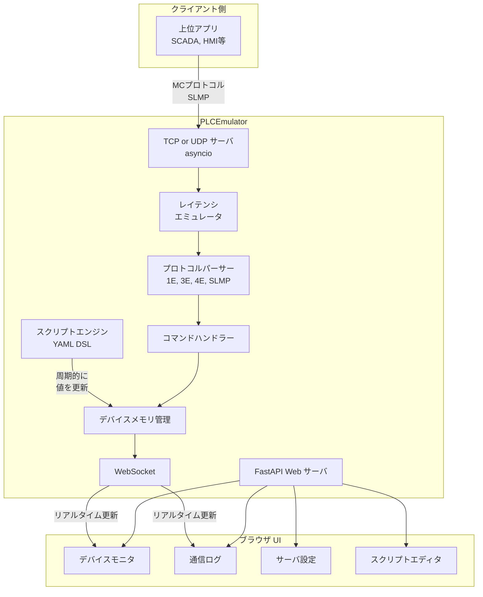

# PLC通信エミュレータ 実装計画 v3

## 概要

三菱電機PLCのMCプロトコル / SLMPに対応した通信エミュレータを開発する。  
PLCの実機がなくても、上位アプリケーション（SCADAやHMI、自作通信プログラム等）の通信テストを可能にするサーバサイドのエミュレータソフトウェア。

参考: [plc-memo.com DummyPLC](https://plc-memo.com/dummyplc/)

---

## v2からの変更点

| 項目 | v2 | v3（今回） |
|:--|:--|:--|
| レイテンシ | なし | **応答遅延エミュレーション（固定/ランダム/正規分布）** |
| デバイス値の動的変更 | なし | **YAMLベースDSLによるスクリプトエンジン** |

---

## 技術スタック

| 要素 | 技術 | 理由 |
|:--|:--|:--|
| **言語** | Python 3.10+ | クロスプラットフォーム、特別な開発環境不要 |
| **PLCサーバ** | asyncio | 非同期TCP/UDPサーバ。標準ライブラリのみ |
| **Web API** | FastAPI | 軽量、非同期対応、WebSocket対応 |
| **Web UI** | HTML / CSS / JavaScript | ブラウザで動作、OS依存なし |
| **スクリプトDSL** | YAML + 安全な式評価 | 宣言的で可読性が高く学習コスト低 |
| **データ永続化** | JSON | シンプルで可読性が高い |
| **テスト** | pytest | Python標準テストフレームワーク |

### 動作要件
- Python 3.10以上
- pip（パッケージ管理）
- モダンブラウザ（Chrome, Firefox, Edge等）

---

## アーキテクチャ



---

## 新機能1: レイテンシエミュレーション

### 概要
実際のPLC通信では、ネットワーク遅延やCPU処理時間による応答遅延が発生する。  
この機能により、応答までの遅延をエミュレートし、タイムアウト処理のテスト等を可能にする。

### 遅延モード

| モード | 説明 | パラメータ |
|:--|:--|:--|
| **なし** | 即座に応答 | ― |
| **固定遅延** | 一定時間待ってから応答 | delay_ms: 遅延ミリ秒 |
| **ランダム遅延** | 指定範囲内のランダム遅延 | min_ms, max_ms: 範囲 |
| **正規分布遅延** | 正規分布に従う遅延 | mean_ms: 平均, std_ms: 標準偏差 |
| **タイムアウト模擬** | 一定確率で応答しない | timeout_rate: タイムアウト確率 0.0-1.0 |

### UI設定
- 遅延モード選択ドロップダウン
- パラメータ入力フィールド（モードに応じて動的表示）
- リアルタイムの遅延統計表示（平均、最大、最小）

### 実装
```python
class LatencyEmulator:
    async def apply_delay(self) -> float:
        """設定に基づいて遅延を適用。実際に待機した時間(ms)を返す"""
        if self.mode == "fixed":
            await asyncio.sleep(self.delay_ms / 1000)
        elif self.mode == "random":
            delay = random.uniform(self.min_ms, self.max_ms)
            await asyncio.sleep(delay / 1000)
        elif self.mode == "normal":
            delay = max(0, random.gauss(self.mean_ms, self.std_ms))
            await asyncio.sleep(delay / 1000)
        elif self.mode == "timeout":
            if random.random() < self.timeout_rate:
                return -1  # 応答しない
```

---

## 新機能2: デバイスメモリスクリプトエンジン

### 概要
YAMLベースのDSLでデバイス値の動的変更シナリオを記述できる。  
PLCのプログラムが動いているかのような動的なデバイス値変化をシミュレートする。

### DSL仕様

#### 基本構文（YAMLファイル）

```yaml
# scripts/example_scenario.yaml
name: "温度センサーシミュレーション"
description: "D100に温度値、D101にステータスを模擬"

scripts:
  # ── 周期実行: 一定間隔でデバイス値を更新 ──
  - name: "温度変化"
    type: periodic
    interval_ms: 1000
    actions:
      - target: D100
        expr: "sin(t * 0.1) * 200 + 2500"    # 25.00℃ ± 2.00℃
      - target: D101
        expr: "D100 + randint(-10, 10)"        # ノイズ付加
      - target: D200
        expr: "D200 + 1"                       # カウンタ

  # ── 条件実行: デバイス値に基づいて分岐 ──
  - name: "異常検知"
    type: conditional
    watch: D100
    interval_ms: 500
    conditions:
      - when: "D100 > 2700"
        actions:
          - target: M100
            value: 1                           # 高温アラーム ON
          - target: D300
            expr: "D300 + 1"                   # アラームカウント
      - when: "D100 <= 2700"
        actions:
          - target: M100
            value: 0                           # 高温アラーム OFF

  # ── シーケンス実行: ステップを順番に実行 ──
  - name: "起動シーケンス"
    type: sequence
    loop: false
    steps:
      - wait_ms: 1000
        actions:
          - target: M0
            value: 1                           # 初期化開始
      - wait_ms: 2000
        actions:
          - target: D0
            value: 100                         # パラメータ設定
          - target: M1
            value: 1                           # 準備完了
      - wait_ms: 500
        actions:
          - target: M0
            value: 0                           # 初期化完了
          - target: M2
            value: 1                           # RUN状態

  # ── ランプ: 値を段階的に変化 ──
  - name: "圧力上昇"
    type: ramp
    target: D500
    start_value: 0
    end_value: 10000
    duration_ms: 5000
    loop: true                                 # 終了後リセットしてループ
```

#### 組み込み関数・変数

| 名前 | 種別 | 説明 |
|:--|:--|:--|
| `t` | 変数 | スクリプト開始からの経過秒数（float） |
| `dt` | 変数 | 前回実行からの経過秒数 |
| `tick` | 変数 | 実行回数カウンタ |
| `D0`, `D100`, ... | 変数 | デバイスの現在値を参照 |
| `M0`, `X0`, `Y0`, ... | 変数 | ビットデバイスの現在値（0 or 1） |
| `sin(x)` | 関数 | サイン |
| `cos(x)` | 関数 | コサイン |
| `abs(x)` | 関数 | 絶対値 |
| `min(a, b)` | 関数 | 最小値 |
| `max(a, b)` | 関数 | 最大値 |
| `clamp(x, lo, hi)` | 関数 | 範囲制限 |
| `random()` | 関数 | 0.0-1.0のランダム値 |
| `randint(a, b)` | 関数 | a-bの整数ランダム値 |
| `floor(x)` | 関数 | 切り捨て |
| `ceil(x)` | 関数 | 切り上げ |
| `int(x)` | 関数 | 整数変換 |
| `square(t, period)` | 関数 | 矩形波（0 or 1） |
| `triangle(t, period)` | 関数 | 三角波（0.0-1.0） |
| `sawtooth(t, period)` | 関数 | ノコギリ波（0.0-1.0） |

#### 安全性
- **サンドボックス実行**: `eval()` や `exec()` は使わず、式をASTパース（`ast.parse` + カスタム評価器）して安全に評価
- ファイルシステムアクセス、ネットワークアクセス、import文は一切不可
- 評価タイムアウト（無限ループ防止）

### Web UIスクリプトエディタ
- YAMLテキストエディタ（シンタックスハイライト付き）
- スクリプトの開始/停止/一時停止ボタン
- 実行中スクリプトのステータス表示
- プリセットシナリオ（温度模擬、カウンタ、シーケンス等）をテンプレートとして提供
- バリデーション（YAML構文チェック + 式の安全性チェック）

---

## 対応プロトコル・フレーム詳細

### フレームフォーマット

| フレーム | サブヘッダ要求 | サブヘッダ応答 | 対応機種 |
|:--|:--|:--|:--|
| **1Eフレーム** | `0x01`等 | `0x81`等 | Aシリーズ, FXシリーズ |
| **3Eフレーム** | `50 00` / `"5000"` | `D0 00` / `"D000"` | Q, L, iQ-R, iQ-F |
| **4Eフレーム** | `54 00` / `"5400"` | `D4 00` / `"D400"` | iQ-R, Q（一部） |

### 対応コマンド一覧

| コマンド | 名称 | サブコマンド | 備考 |
|:--|:--|:--|:--|
| `0401` | 一括読出し | `0000`=ワード, `0001`=ビット | 最重要 |
| `1401` | 一括書込み | `0000`=ワード, `0001`=ビット | 最重要 |
| `0403` | ランダム読出し | `0000` | ワード+ダブルワード混在 |
| `1402` | ランダム書込み | `0000` | ワード+ダブルワード混在 |
| `0801` | モニタ登録 | `0000` | 登録後0802で読出し |
| `0802` | モニタ実行 | `0000` | 登録済みデバイス読出し |
| `0101` | CPU型名読出し | `0000` | 接続確認に使用 |
| `1001` | リモートRUN | `0000` | CPU状態切替 |
| `1002` | リモートSTOP | `0000` | CPU状態切替 |
| `0619` | ループバックテスト | `0000` | 通信テスト用 |
| `1630` | リモートパスワードアンロック | `0000` | ― |
| `1631` | リモートパスワードロック | `0000` | ― |

### MCプロトコルとSLMPの差分

> [!NOTE]
> 同じ3E/4Eフレーム構造だが**デバイス指定のバイト長が異なる**:
> - MCプロトコル: アドレス3バイト + デバイスコード1バイト = 4バイト（サブコマンド `0000`/`0001`）
> - SLMP: アドレス4バイト + デバイスコード2バイト = 6バイト（サブコマンド `0002`/`0003`）
> 
> サブコマンド値で自動判定し、内部で吸収する。

### 対応デバイス

#### ビットデバイス

| デバイス | 名称 | コード 3E Bin | コード 1E | アドレス形式 |
|:--|:--|:--|:--|:--|
| X | 入力リレー | `0x9C` | `0x58` | 16進数 |
| Y | 出力リレー | `0x9D` | `0x59` | 16進数 |
| M | 内部リレー | `0x90` | `0x4D` | 10進数 |
| L | ラッチリレー | `0x92` | `0x4C` | 10進数 |
| F | アナンシエータ | `0x93` | ― | 10進数 |
| V | エッジリレー | `0x94` | ― | 10進数 |
| B | リンクリレー | `0xA0` | `0x42` | 16進数 |
| SM | 特殊リレー | `0x91` | ― | 10進数 |
| SB | リンク特殊リレー | `0xA1` | ― | 16進数 |
| S | ステップリレー | `0x98` | ― | 10進数 |
| TS | タイマ接点 | `0xC1` | ― | 10進数 |
| TC | タイマコイル | `0xC0` | ― | 10進数 |
| CS | カウンタ接点 | `0xC4` | ― | 10進数 |
| CC | カウンタコイル | `0xC3` | ― | 10進数 |

#### ワードデバイス

| デバイス | 名称 | コード 3E Bin | コード 1E | アドレス形式 |
|:--|:--|:--|:--|:--|
| D | データレジスタ | `0xA8` | `0x44` | 10進数 |
| W | リンクレジスタ | `0xB4` | `0x57` | 16進数 |
| R | ファイルレジスタ | `0xAF` | `0x52` | 10進数 |
| ZR | 拡張ファイルレジスタ | `0xB0` | ― | 16進数 |
| SD | 特殊レジスタ | `0xA9` | ― | 10進数 |
| SW | リンク特殊レジスタ | `0xB5` | ― | 16進数 |
| TN | タイマ現在値 | `0xC2` | ― | 10進数 |
| CN | カウンタ現在値 | `0xC5` | ― | 10進数 |

### エミュレート対象PLC機種

| 機種名 | シリーズ | CPU型名文字列 | Dレンジ | Mレンジ | 対応フレーム |
|:--|:--|:--|:--|:--|:--|
| Q03UDE | MELSEC-Q | `"Q03UDE          "` | D0-12287 | M0-8191 | 1E, 3E, 4E |
| Q06UDE | MELSEC-Q | `"Q06UDE          "` | D0-12287 | M0-8191 | 1E, 3E, 4E |
| R04CPU | MELSEC iQ-R | `"R04CPU          "` | D0-65535 | M0-65535 | 1E, 3E, 4E |
| R08CPU | MELSEC iQ-R | `"R08CPU          "` | D0-65535 | M0-65535 | 1E, 3E, 4E |
| FX5U | MELSEC iQ-F | `"FX5UCPU         "` | D0-32767 | M0-32767 | 1E, 3E |
| L06CPU | MELSEC-L | `"L06CPU          "` | D0-12287 | M0-8191 | 1E, 3E, 4E |

### エラーコード

| コード | 説明 |
|:--|:--|
| `0x0000` | 正常完了 |
| `0xC050` | コマンド/応答タイプ仕様外 |
| `0xC051` | 開始アドレス範囲外 |
| `0xC056` | デバイス指定エラー |
| `0xC058` | デバイスアドレス無効 |
| `0xC059` | 未サポートコマンド |
| `0xC05B` | パラメータエラー |
| `0xC061` | データ長不一致 |

---

## プロジェクト構成

```
PLCEmulator/
├── README.md
├── requirements.txt
├── main.py                            # エントリーポイント
│
├── src/
│   ├── __init__.py
│   ├── config.py                      # 設定管理・永続化
│   │
│   ├── protocol/                      # プロトコル処理
│   │   ├── __init__.py
│   │   ├── base.py                    # プロトコルハンドラー基底クラス
│   │   ├── constants.py               # 全定数
│   │   ├── device_parser.py           # デバイスアドレス解析
│   │   ├── mc_frame_1e.py             # 1Eフレーム処理
│   │   ├── mc_frame_3e.py             # 3Eフレーム処理
│   │   ├── mc_frame_4e.py             # 4Eフレーム処理
│   │   ├── slmp_handler.py            # SLMP拡張デバイス指定
│   │   └── command_processor.py       # コマンド実行ロジック
│   │
│   ├── device/                        # デバイスメモリ管理
│   │   ├── __init__.py
│   │   ├── device_manager.py
│   │   ├── device_definition.py
│   │   └── plc_models.py
│   │
│   ├── server/                        # 通信サーバ
│   │   ├── __init__.py
│   │   ├── tcp_server.py
│   │   ├── udp_server.py
│   │   └── latency.py                # ★ レイテンシエミュレータ
│   │
│   ├── scripting/                     # ★ スクリプトエンジン
│   │   ├── __init__.py
│   │   ├── engine.py                  # スクリプト実行エンジン
│   │   ├── parser.py                  # YAML DSLパーサー
│   │   ├── evaluator.py              # 安全な式評価器
│   │   └── builtins.py               # 組み込み関数定義
│   │
│   ├── web/                           # Web API
│   │   ├── __init__.py
│   │   ├── app.py
│   │   ├── api_routes.py
│   │   └── websocket_handler.py
│   │
│   └── i18n/                          # 国際化
│       ├── __init__.py
│       ├── i18n.py
│       ├── ja.json
│       └── en.json
│
├── static/                            # フロントエンド
│   ├── index.html
│   ├── css/
│   │   └── style.css
│   └── js/
│       ├── app.js
│       ├── device_monitor.js
│       ├── comm_log.js
│       ├── settings.js
│       ├── script_editor.js           # ★ スクリプトエディタUI
│       └── i18n.js
│
├── scripts/                           # ★ スクリプト保存ディレクトリ
│   └── examples/
│       ├── temperature_sim.yaml       # 温度センサーシミュレーション
│       ├── counter.yaml               # カウンタ
│       ├── sequence.yaml              # 起動シーケンス
│       └── waveforms.yaml             # 各種波形生成
│
├── data/
│   └── device_state.json
│
├── tests/
│   ├── __init__.py
│   ├── test_mc_frame_3e.py
│   ├── test_mc_frame_1e.py
│   ├── test_mc_frame_4e.py
│   ├── test_command_processor.py
│   ├── test_device_manager.py
│   ├── test_slmp_handler.py
│   ├── test_latency.py                # ★ レイテンシテスト
│   ├── test_script_engine.py          # ★ スクリプトエンジンテスト
│   └── test_evaluator.py             # ★ 式評価器テスト
│
└── docs/
    ├── protocol_reference.md
    └── script_dsl_reference.md        # ★ DSLリファレンス
```

---

## コンポーネント詳細

---

### 1. プロトコル処理: `src/protocol/`

##### [NEW] constants.py
全プロトコル定数を集約:
- コマンドコード: `BATCH_READ = 0x0401`, `BATCH_WRITE = 0x1401` 等
- サブコマンド: `SUBCOMMAND_WORD = 0x0000`, `SUBCOMMAND_BIT = 0x0001`, `SUBCOMMAND_WORD_EXT = 0x0002`, `SUBCOMMAND_BIT_EXT = 0x0003`
- デバイスコード辞書（3Eフレーム用・1Eフレーム用）
- サブヘッダ定数、エラーコード定数

##### [NEW] base.py
```python
class ProtocolHandler(ABC):
    @abstractmethod
    def parse_request(self, data: bytes) -> ParsedRequest
    @abstractmethod
    def build_response(self, parsed: ParsedRequest, result: CommandResult) -> bytes
    @abstractmethod
    def detect(self, data: bytes) -> bool
```

##### [NEW] mc_frame_3e.py
3Eフレーム（バイナリ/ASCII）のリクエスト解析・レスポンス生成

##### [NEW] mc_frame_1e.py
1Eフレーム処理（サブヘッダ値によるコマンド判定）

##### [NEW] mc_frame_4e.py
4Eフレーム処理（3Eフレーム + シリアル番号拡張）

##### [NEW] slmp_handler.py
SLMP固有の拡張デバイス指定（4バイトアドレス + 2バイトコード）

##### [NEW] device_parser.py
デバイスアドレスの解析・変換（フレーム形式ごとのバイト長差分を吸収）

##### [NEW] command_processor.py
コマンド別処理ロジック（DeviceManagerとの連携、エラーチェック）

---

### 2. デバイスメモリ管理: `src/device/`

##### [NEW] device_manager.py
- `dict[str, list[int]]` でデバイスメモリ管理
- ビットデバイスは16ビット単位でワード内にパッキング
- スレッドセーフ（threading.Lock）
- 値変更時のコールバック（WebSocket通知用）
- JSON保存/読込

##### [NEW] device_definition.py
デバイス型定義（DeviceType enum, DeviceInfo dataclass）

##### [NEW] plc_models.py
PLC機種プロファイル（各機種のデバイスレンジ、CPU型名）

---

### 3. 通信サーバ: `src/server/`

##### [NEW] tcp_server.py
- asyncio TCPサーバ、1クライアント接続制限
- クライアント切断検知・再接続対応
- レイテンシエミュレータとの連携

##### [NEW] udp_server.py
- asyncio UDPサーバ（ステートレス）

##### [NEW] latency.py ★新規
レイテンシエミュレータ:
- 遅延モード: なし / 固定 / ランダム / 正規分布 / タイムアウト模擬
- `async apply_delay()` で非同期待機
- 統計情報の収集（平均・最大・最小遅延）
- 設定のリアルタイム変更対応

---

### 4. スクリプトエンジン: `src/scripting/` ★新規

##### [NEW] engine.py
スクリプト実行エンジン:
- YAMLファイルからスクリプト定義を読込
- asyncioタスクとして周期実行
- スクリプトの開始/停止/一時停止制御
- 複数スクリプトの同時実行
- 実行状態の通知（WebSocket経由）

##### [NEW] parser.py
YAML DSLパーサー:
- スクリプト定義の解析・バリデーション
- スクリプトタイプ（periodic / conditional / sequence / ramp）の判別
- 式の構文チェック

##### [NEW] evaluator.py
安全な式評価器:
- `ast.parse()` でPython式をASTに変換
- ホワイトリスト方式でノード種別を制限（`ast.BinOp`, `ast.Compare`, `ast.Call` 等のみ許可）
- 許可された関数のみ呼出し可能
- デバイス値参照の解決（`D100` → `device_manager.read_word("D", 100)`）
- 評価タイムアウト（安全措置）

##### [NEW] builtins.py
組み込み関数:
- 数学関数: `sin`, `cos`, `abs`, `min`, `max`, `floor`, `ceil`, `int`
- 範囲制限: `clamp(x, lo, hi)`
- 乱数: `random()`, `randint(a, b)`
- 波形生成: `square(t, period)`, `triangle(t, period)`, `sawtooth(t, period)`

---

### 5. Web UI: `static/` + `src/web/`

##### [NEW] src/web/api_routes.py
REST API:
- `GET/PUT /api/config` — 設定管理
- `POST /api/server/start|stop` — サーバ制御
- `GET /api/devices/{type}` — デバイス値取得
- `PUT /api/devices/{type}/{address}` — デバイス値書込み
- `POST /api/devices/save|load|clear` — デバイス永続化
- `GET /api/latency/stats` — レイテンシ統計 ★
- `PUT /api/latency/config` — レイテンシ設定 ★
- `GET /api/scripts` — スクリプト一覧 ★
- `POST /api/scripts/load` — スクリプト読込 ★
- `POST /api/scripts/{id}/start|stop|pause` — スクリプト制御 ★
- `PUT /api/scripts/{id}` — スクリプト編集 ★
- `GET /api/i18n/{lang}` — 翻訳データ

##### [NEW] static/js/script_editor.js ★新規
スクリプトエディタUI:
- YAMLテキストエディタ（行番号・シンタックスハイライト付き）
- スクリプト開始/停止/一時停止ボタン
- 実行中スクリプトのステータスインジケータ
- プリセットテンプレート選択
- バリデーション結果表示

その他のUI（デバイスモニタ、通信ログ、設定画面）はv2と同一。

---

## 参考ツールからの改善点

| 項目 | 参考ツール DummyPLC | 本ツール |
|:--|:--|:--|
| プラットフォーム | Windows専用 | **クロスプラットフォーム** |
| GUI | WinForms/WPF | **ブラウザベース Web UI** |
| クライアント切断時 | 再接続不可 | **自動再接続可能** |
| 4Eフレーム | 未対応 | **対応** |
| SLMP拡張デバイス指定 | 一部未対応 | **完全対応** |
| デバイスモニタ | 別ツール | **統合** |
| 多言語 | 日本語のみ | **日本語/英語** |
| デバイス値保存 | なし | **JSON保存/読込** |
| レイテンシ | なし | **応答遅延エミュレーション** ★ |
| デバイス値の動的変更 | なし | **YAMLスクリプトエンジン** ★ |

---

## 検証計画

### 自動テスト
```bash
pytest tests/ -v
```

テスト項目:
- 各フレーム（1E/3E/4E）のリクエスト解析・レスポンス生成
- 各コマンドの正常系・異常系処理
- SLMP拡張デバイス指定
- デバイスメモリ読み書き
- Binary/ASCII両モード
- レイテンシエミュレータの各モード ★
- スクリプトDSLパーサー ★
- 安全な式評価器（許可された関数のみ実行、悪意のある式の拒否） ★
- スクリプト実行エンジン（periodic, conditional, sequence, ramp） ★

### 手動検証
- ループバック（127.0.0.1）でTCPクライアントから電文送信
- DummyPLC記事の電文例との応答比較
- Web UIの動作確認（各ブラウザ）
- スクリプト実行中のデバイスモニタ値変化確認 ★

---

## 開発フェーズ

### Phase 1: コア基盤
1. プロジェクト構造作成・`requirements.txt`
2. 定数定義（`constants.py`）
3. デバイスメモリ管理（`device_manager.py`, `device_definition.py`）
4. PLC機種プロファイル（`plc_models.py`）
5. TCPサーバ基盤（`tcp_server.py`）
6. UDPサーバ基盤（`udp_server.py`）
7. レイテンシエミュレータ（`latency.py`） ★

### Phase 2: MCプロトコル 3Eフレーム
1. デバイスアドレス解析（`device_parser.py`）
2. 3Eフレーム バイナリ解析・応答生成（`mc_frame_3e.py`）
3. コマンド処理: 一括読出し / 一括書込み
4. コマンド処理: ランダム読出し / ランダム書込み
5. コマンド処理: CPU型名読出し / ループバックテスト
6. ユニットテスト

### Phase 3: 1E / 4E / SLMP + ASCII対応
1. 1Eフレーム対応（`mc_frame_1e.py`）
2. 4Eフレーム対応（`mc_frame_4e.py`）
3. SLMP拡張デバイス指定（`slmp_handler.py`）
4. ASCIIモード対応
5. モニタ登録/実行、リモートRUN/STOP
6. ユニットテスト

### Phase 4: スクリプトエンジン ★
1. 安全な式評価器（`evaluator.py`）
2. 組み込み関数（`builtins.py`）
3. YAML DSLパーサー（`parser.py`）
4. スクリプト実行エンジン（`engine.py`）
5. サンプルスクリプト作成
6. ユニットテスト

### Phase 5: Web UI
1. FastAPI + WebSocketセットアップ
2. REST APIルート
3. メインページ HTML/CSS（ダークモード）
4. デバイスモニタ
5. 通信ログ
6. 設定画面（レイテンシ設定含む）
7. スクリプトエディタ ★
8. 多言語対応

### Phase 6: 仕上げ
1. デバイス値永続化（JSON保存/読込）
2. エラー応答切替機能
3. 全体統合テスト
4. README.md作成
5. DSLリファレンスドキュメント ★
