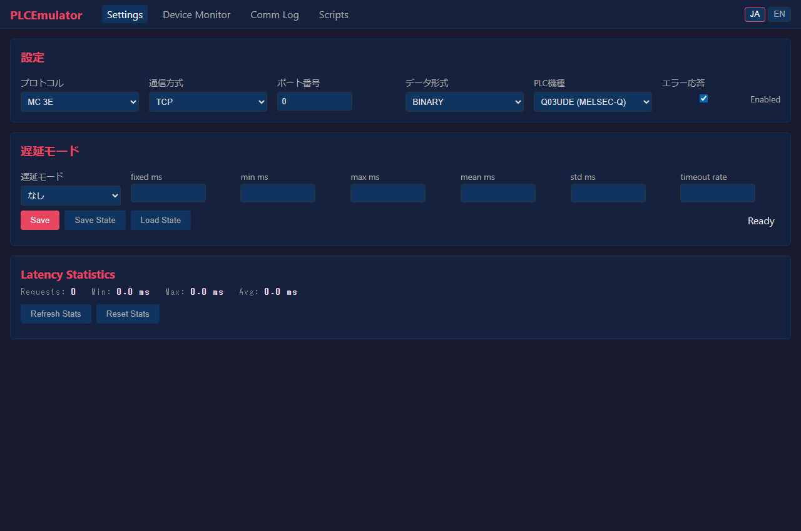
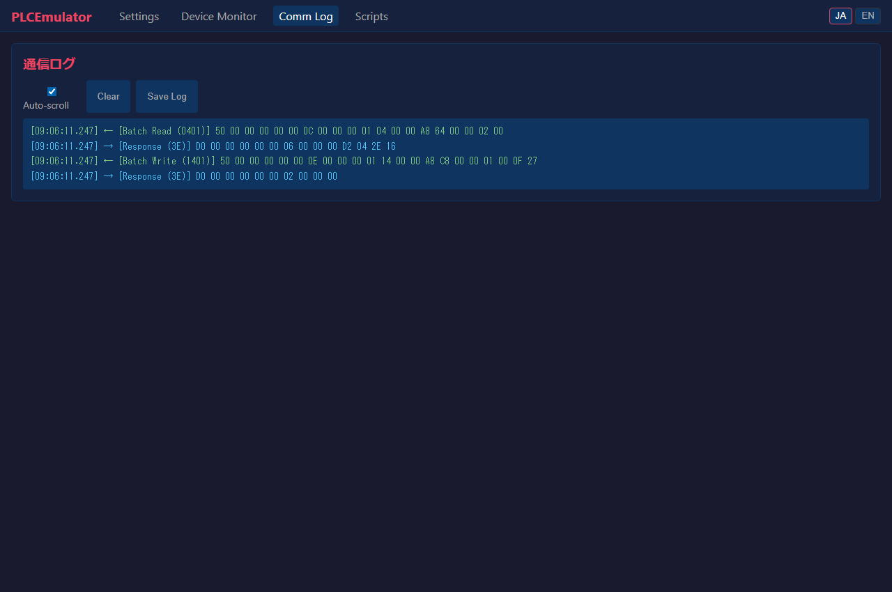
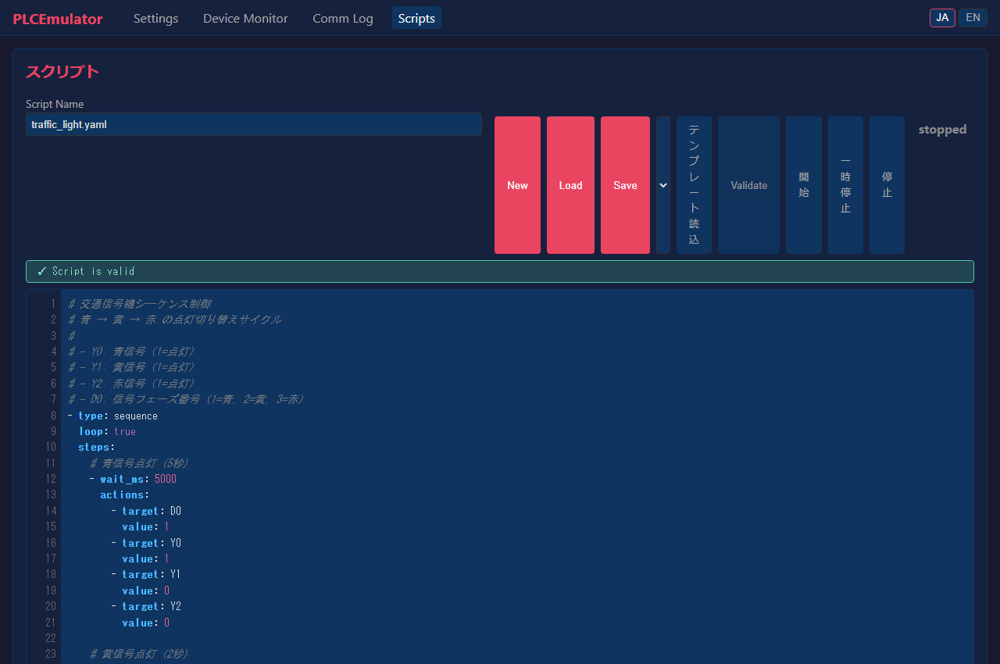

# PLCEmulator ユーザーマニュアル (User Manual)

本マニュアルでは、三菱電機 MELSEC MCプロトコル / SLMP 対応のPLC通信エミュレータ「**PLCEmulator**」の基本操作、Web UI の各画面の使い方、実践的なテスト方法について解説します。

---

## 目次

1. [概要と特徴](#1-概要と特徴)
2. [クイックスタート](#2-クイックスタート)
3. [画面別操作ガイド（画面キャプチャ付き）](#3-画面別操作ガイド)
   - [3.1 設定画面 (Settings)](#31-設定画面-settings)
   - [3.2 デバイスモニタ画面 (Device Monitor)](#32-デバイスモニタ画面-device-monitor)
   - [3.3 通信ログ画面 (Comm Log)](#33-通信ログ画面-comm-log)
   - [3.4 スクリプトエディタ画面 (Script Editor)](#34-スクリプトエディタ画面-script-editor)
4. [実践テストシナリオ](#4-実践テストシナリオ)
5. [REST API 連携](#5-rest-api-連携)
6. [よくある質問・トラブルシューティング](#6-よくある質問トラブルシューティング)

---

## 1. 概要と特徴

PLCEmulator は、実機 PLC（シーケンサ）が手元にない開発環境でも、SCADA、MES、IoTゲートウェイ、自作通信プログラム等の開発・結合テストを可能にするオープンソースのエミュレータです。

### 主な対応機能
- **マルチプロトコル対応**: MCプロトコル 3Eフレーム（バイナリ/ASCII）、4Eフレーム、1Eフレーム、および SLMP（Seamless Message Protocol）に対応。
- **柔軟なトランスポート**: TCP および UDP の両方をサポート（ポート番号・機種設定を稼働中に動的切替可能）。
- **主要コマンド網羅**: 一括読出/書込（`0401`/`1401`）、ランダム読書（`0403`/`1402`）、モニタ登録/実行（`0801`/`0802`）、CPU型名読出（`0101`）、リモートRUN/STOP（`1001`/`1002`）、リモートパスワードロック/解除（`1630`/`1631`）。
- **リアルタイム Web ダッシュボード**: デバイスメモリの監視・直接編集、通信電文ログの解析、各種フォーマット変換、YAMLスクリプト実行エンジンをブラウザから操作可能。
- **レイテンシ・障害エミュレーション**: ネットワーク遅延（固定、ランダム、正規分布）やパケットタイムアウト、エラー応答遮断をシミュレート可能。

---

## 2. クイックスタート

### 起動手順

```bash
# 依存パッケージの同期 (uv を使用する場合)
uv sync

# エミュレータの起動
uv run python main.py
```

起動すると、以下の2つのサービスが並行して起動します:
- **PLC 通信サーバ**: デフォルト `TCP 5000` ポート (0.0.0.0)
- **Web UI ダッシュボード**: `http://127.0.0.1:8000`

ブラウザで `http://127.0.0.1:8000` にアクセスすると、ダッシュボード画面が表示されます。画面右上のボタンで **JA（日本語）** / **EN（英語）** の言語切替が可能です。

---

## 3. 画面別操作ガイド

### 3.1 設定画面 (Settings)

エミュレータの通信プロトコル、ネットワーク設定、PLC機種プロファイル、レイテンシ（遅延）模擬、状態の保存/読込を行います。



#### 主な項目と設定方法
1. **通信設定 (Server Configuration)**:
   - **プロトコル (Protocol)**: `3E`, `1E`, `4E`, `SLMP` から選択。稼働中に即時切り替え可能です。
   - **通信方式 (Transport)**: `TCP` または `UDP` を選択。
   - **ポート番号 (Port)**: クライアントが接続する PLC 通信ポート（デフォルト: `5000`）。
   - **データ形式 (Format)**: `BINARY` または `ASCII` を選択（3E 選択時）。
   - **PLC機種 (PLC Model)**: `Q03UDE`, `Q06UDE`, `R04CPU`, `R08CPU`, `FX5U`, `L06CPU` から選択。機種に応じたデバイスレンジ（D, M, X, Y 等の上限）および型名読出応答が自動適用されます。
   - **エラー応答 (Error Response)**: チェックを外すと、不正電文受信時にエラーパケットを返さずドロップする（無応答状態を模倣する）動作になります。
   - **Save ボタン**: 設定変更を稼働中の通信サーバへ即座に反映します。

2. **遅延モード設定 (Latency Mode)**:
   - `None` (遅延なし), `Fixed` (固定遅延), `Random` (一様乱数), `Normal` (正規分布), `Timeout` (タイムアウト模擬) から選択。
   - `fixed ms` や `timeout rate` などのパラメータを指定し、劣悪な回線環境をテストできます。

3. **通信統計パネル (Latency Statistics)**:
   - 送信パケット数、平均遅延、最大遅延、最小遅延、発生したタイムアウト数をリアルタイム集計。
   - 「Refresh」で最新状態へ更新、「Reset」で集計カウンタをゼロクリアします。

4. **状態の保存 / 読込 (State Save / Load)**:
   - 「Save State」で現在の全デバイスメモリの値を JSON 形式で保存。
   - 「Load State」で保存されたデバイスメモリ状態を復元します。

---

### 3.2 デバイスモニタ画面 (Device Monitor)

PLC 内部のデバイス値（D, W, M, X, Y, L, B, R, ZR 等）をリアルタイムに一覧監視・直接編集する画面です。


#### 主な機能と使い方
1. **デバイスの追加**:
   - **Device**: 監視したいデバイス種別（D, M, X, Y など）を選択。
   - **Address**: 開始アドレスを指定（例: `100`）。Enter キーでも追加可能。
   - **Points (点数)**: 監視したい点数を指定（例: `3`）。`D100`, `D101`, `D102` のように連続したアドレスが一括登録されます。
   - **Format**: 初期表示形式（DEC, DEC Signed, HEX, BIN, FLOAT, ASCII）を選択。
   - **Add ボタン**: 監視テーブルに追加されます。同一アドレスが既に登録済みの場合は形式が更新されます。

2. **種別タブによるフィルタリング**:
   - **「ALL」タブ**: 登録されている全デバイスをまとめて1つのテーブルで監視（デフォルト）。
   - **「D」「W」「M」などの各タブ**: クリックすると該当デバイス種別のみに絞り込んで表示します。

3. **6種類の多彩な表示形式**:
   - 各行のプルダウンから、個別に表示形式をいつでも切り替えられます:
     - `DEC`: 16ビット符号なし整数（0 〜 65535）
     - `DEC (Signed)`: 16ビット符号付き整数（-32768 〜 32767）
     - `HEX`: 16進数表記（例: `0x1234`）
     - `BIN`: 2進数表記（例: `0b0001001000110100`）
     - `FLOAT`: 32ビット単精度浮動小数点数（連続する2ワードを自動合成）
     - `ASCII`: アスキー文字列表記（1ワードあたり2文字）

4. **インライン直接編集**:
   - **値のセルをダブルクリック**すると入力ボックスが表示され、ブラウザから数値を直接書き込めます。
   - 入力した値はエミュレータの内部メモリへ即時反映され、通信クライアント側の読出し値も同期します。

5. **削除と全クリア**:
   - 各行右端の **「×」ボタン**: 該当アドレスを監視対象から削除。
   - **「Clear All」ボタン**: 確認ダイアログ後、監視テーブルの全行をクリアし、同時にデバイスメモリの値もゼロ初期化します。

---

### 3.3 通信ログ画面 (Comm Log)

クライアント（SCADA、通信テストツール等）と PLC 通信サーバ間で送受信された生のパケット電文をリアルタイムに解析・表示します。



#### 主な機能
1. **電文の自動解析と色分け表示**:
   - **受信（RX `<-`、緑色）**: クライアントからエミュレータへ届いた要求電文。
   - **送信（TX `->`、青色）**: エミュレータからクライアントへ返した応答電文。
   - **解析済みコマンドバッジ**: `[Batch Read (0401)]` や `[Batch Write (1401)]` など、主要なコマンド名とコードを自動識別して見やすくバッジ表示。
   - **HEX ダンプ**: 生のバイト列を 16 進数表記で確認可能。
   - **機密情報の自動マスク**: パスワード解除（`1630`）等の機密電文ペイロードは `**` で安全にマスクされます。

2. **操作コントロール**:
   - **Auto-scroll チェックボックス**: 新しいログが届いた際に最下部へ自動スクロールするかどうかを切り替えます。
   - **Clear ボタン**: 画面上のログ一覧をクリアします。
   - **Save Log ボタン**: 表示中の送受信ログを、タイムスタンプ・方向・コマンドバッジ・HEX値をそのまま保持したテキストファイル（`.txt`）としてワンクリックでダウンロード保存します。

---

### 3.4 スクリプトエディタ画面 (Script Editor)

設備側のセンサーや信号機、タンク水位などの自律的な挙動をシミュレートする YAML DSL スクリプトの作成・実行管理を行います。



#### 主な機能
1. **構文ハイライト & 行番号付きエディタ**:
   - YAML のキー、文字列、数値、真偽値、コメント（`#`）を自動色分け。
   - 行番号ガターが連動し、長いスクリプトでも編集位置を一目で把握できます。

2. **プリセットテンプレートの活用**:
   - 画面上部の **「Template」ドロップダウン** または右下の **「Preset Templates」一覧** から、提供済みの産業用シミュレーションシナリオを選択して「Load Template」を押すだけで即座にエディタへ読み込めます:
     - `traffic_light.yaml`: 信号機の点灯シーケンス制御
     - `tank_level_control.yaml`: タンク水位の上昇・下降・ポンプ制御
     - `alarm_interlock.yaml`: 閾値超過時のアラームビット連動
     - `cylinder_sequence.yaml`: シリンダーの前進・後退サイクル
     - `sensor_simulation.yaml`: 正弦波（`sin`）やノイズによるセンサー値変動
     - `ramp_loop.yaml`: 三角波・ランプアップ往復動作

3. **安全なバリデーション (Validate)**:
   - 「Validate」ボタンをクリックすると、Python AST による構文チェックおよびサンドボックス安全検査を即時実行。
   - 不正な関数呼び出し（`import`, `eval` 等）や構文ミスを事前に検知し、安全性を確認できます。

4. **スクリプトの実行制御**:
   - **Start**: スクリプトの実行を開始（ステータスが緑色の `running` に遷移）。
   - **Pause**: 実行を一時停止（ステータスが黄色の `paused` に遷移）。再度 Start で再開可能。
   - **Stop**: スクリプトの実行を停止（ステータスが `stopped` に遷移）。

---

## 4. 実践テストシナリオ

### シナリオ A: SCADA / PLC 通信ドライバの結合テスト
1. **Settings** でプロトコルを `3E (Binary)`、ポートを `5000` に設定して「Save」。
2. 開発中の SCADA や通信ライブラリから `127.0.0.1:5000` に対して接続。
3. **Comm Log** 画面を開き、クライアントが送信した `0401`（一括読出）電文とエミュレータの応答がリアルタイムに流れることを確認。
4. **Device Monitor** で `D100` などの値を直接編集し、SCADA 側の画面表示が即座に連動して書き換わることを確認。

### シナリオ B: タイムアウト & ネットワーク障害の耐性テスト
1. **Settings** 画面の「Latency Mode」を `Timeout` に設定し、`timeout rate: 0.3`（30%確率でタイムアウト）に設定。
2. クライアント側でパケット消失やタイムアウト発生時のリトライ処理・エラーログ記録が期待通りに動作するかを検証。
3. **Latency Statistics** パネルで、実際に発生したタイムアウト回数を数値で確認。

### シナリオ C: 自動シミュレーションによる長時間ランニングテスト
1. **Script Editor** で `sensor_simulation.yaml` または `traffic_light.yaml` テンプレートを読み込み。
2. 「Start」をクリックして自動シミュレーションを開始。
3. **Device Monitor** を開くと、指定した周期でデバイス値が自動的に変化（カウントアップ、波形出力、ビットON/OFF）し続けるため、監視システムの長時間ポーリングテストを無人で実施可能。

---

## 5. REST API 連携

エミュレータの全機能は REST API 経由でも操作可能です（外部の自動テストスクリプトや CI パイプラインから利用可能）。

| メソッド | エンドポイント | 説明 |
|---|---|---|
| `GET` | `/api/config` | 現在のサーバ設定を取得 |
| `POST` | `/api/config` | サーバ設定を動的変更（プロトコル、ポート、機種等） |
| `GET` | `/api/devices/{type}?start={s}&count={n}` | デバイス値を一括読出 |
| `PUT` | `/api/devices/{type}/{address}` | デバイス値を1点書込み（JSON: `{"value": 123}`） |
| `POST` | `/api/devices/clear` | デバイスメモリを一括クリア |
| `GET` | `/api/comm_log/export` | 表示中の通信ログをテキストファイルとしてダウンロード |
| `GET` | `/api/latency/stats` | レイテンシ統計データを取得 |
| `POST` | `/api/latency/stats/reset` | レイテンシ統計をリセット |
| `GET` | `/api/scripts/templates` | プリセットスクリプト一覧を取得 |
| `POST` | `/api/scripts/{name}/start` | スクリプトの実行を開始 |

---

## 6. よくある質問・トラブルシューティング

#### Q1. クライアントから接続できない（Connection Refused）
- 設定画面で「Port」が正しいか確認してください（デフォルトは `5000`）。
- OS のファイアウォールで該当ポートの着信が許可されているか確認してください。
- 別のプロセス（以前起動したエミュレータなど）が同一ポートを占有していないか確認してください。

#### Q2. デバイスモニタで追加したはずのデバイスが表示されない
- デバイス種別タブが特定のもの（例: 「M」タブ）になっていないか確認してください。「ALL」タブを選択すると、登録されたすべてのデバイスが一覧表示されます。

#### Q3. 通信エラーコード `0xC051` や `0xC058` が返ってくる
- 選択している「PLC機種（PLC Model）」の使用可能アドレス範囲を超えてアクセスしています（例: FX5U の Dレジスタ上限は 32767）。実機の仕様範囲内を指定するか、必要に応じて大容量機種（`R08CPU` 等）に切り替えてください。

#### Q4. MCプロトコルのバイナリ形式とASCII形式の違いは？
- バイナリ形式はデータをバイト列そのまま（サブヘッダ `50 00`）で通信し、最も一般的で高速です。
- ASCII形式はデータを16進テキスト（サブヘッダ `35 30 30 30` = `"5000"`）として送受信します。上位機器の設定に合わせて「Format」を切り替えてください。
